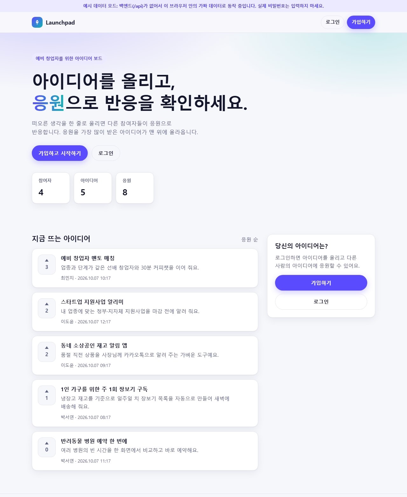
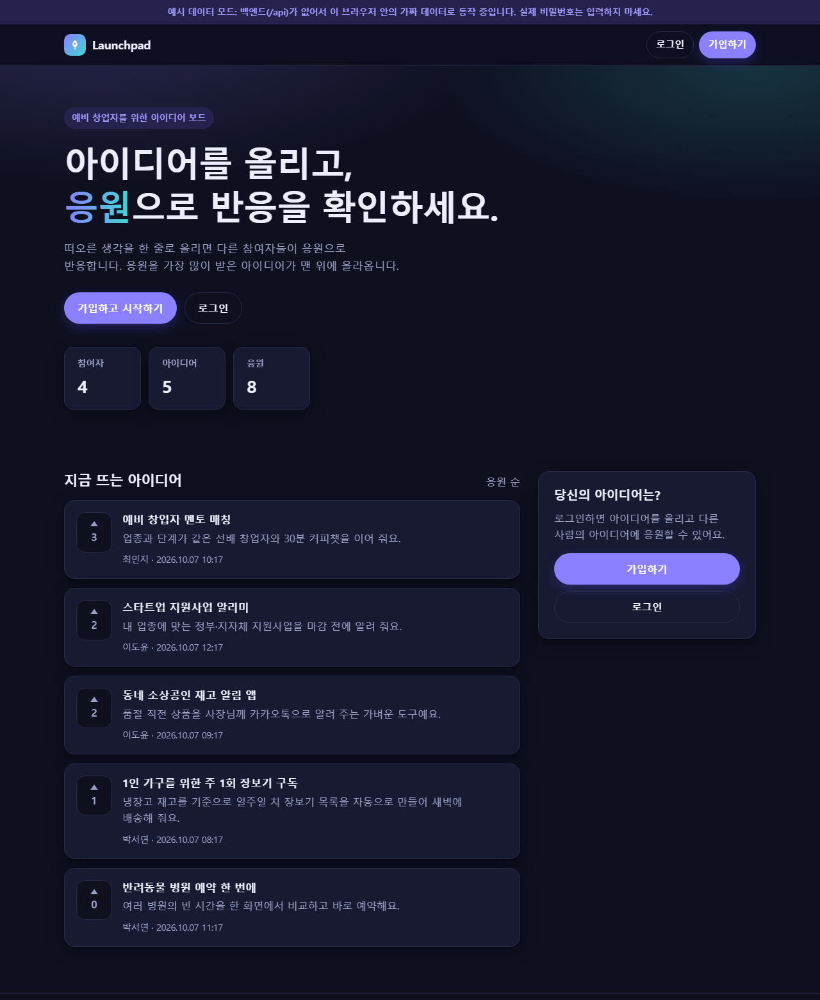
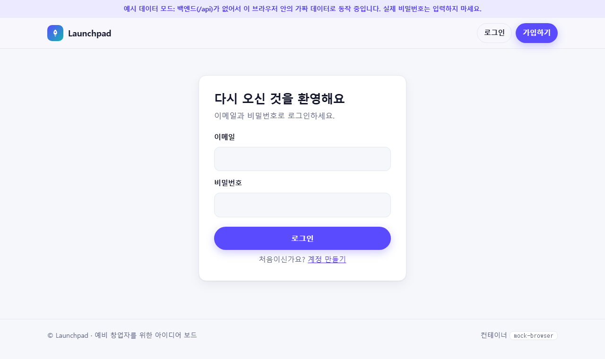
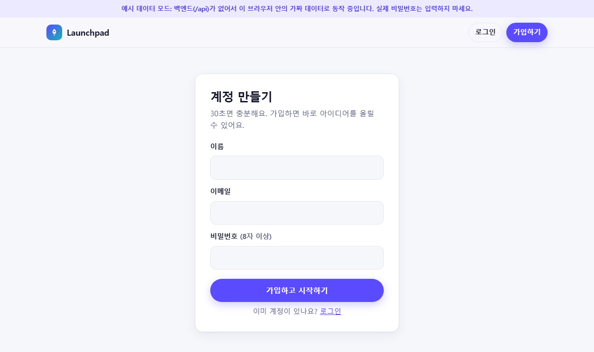
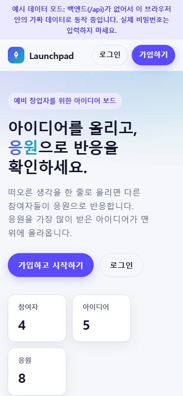

# Launchpad 아이디어 보드 (샘플 프런트)

예비 창업자가 아이디어를 올리고, 서로 **응원**해 주는 작은 웹 서비스의 화면이에요.
Paved Clouds로 배포해 볼 **샘플 웹의 프런트**이고, 서버 코드는 들어 있지 않아요.
백엔드와 MySQL은 샘플 백엔드 담당이 이 화면에 맞춰 붙여요.

## 이런 화면이에요

백엔드 없이 예시 데이터 모드로 찍은 화면이에요. 맨 위 안내 줄과 푸터의 `mock-browser`는 예시 모드에서만 보이고, 진짜 백엔드가 연결되면 사라져요.

**메인 (PC)** · 라이트와 다크는 브라우저 설정을 따라가요.

| 라이트 | 다크 |
|---|---|
|  |  |

**로그인 · 회원가입 · 모바일**

| 로그인 | 회원가입 | 모바일 메인 |
|---|---|---|
|  |  |  |

## 바로 열어 보기

- **`index.html`을 더블클릭**하면 돼요. 서버가 없어도 예시 데이터로 움직이고, 가입·로그인·글쓰기·응원이 전부 되어요.
- 예시 데이터는 내 브라우저(`localStorage`)에만 저장돼요. 처음 상태로 되돌리려면 개발자 도구에서 저장소를 지우면 돼요.
- 서버로 열고 싶다면 이 폴더에서 `python -m http.server 8080`을 실행하고 http://localhost:8080 으로 들어가세요.

## 파일 구성

| 파일 | 하는 일 |
|---|---|
| `index.html` | 메인 화면: 소개, 통계, 아이디어 목록(응원 많은 순), 글쓰기 폼 |
| `login.html`, `signup.html` | 로그인, 회원가입 |
| `style.css` | 디자인. 외부 폰트나 CDN 없이 시스템 글꼴만 써요. 라이트·다크 모드와 모바일을 지원해요 |
| `app.js` | 화면 동작. `fetch`로 `/api`를 호출해요 |
| `mock-api.js` | `MOCK:` 백엔드가 없을 때만 쓰이는 브라우저 안의 가짜 API예요. 연결이 끝나면 지워도 돼요 |

## 백엔드 담당께: 이것만 맞춰 주세요

이 폴더를 서버가 **루트(`/`)에서 정적 파일로** 내려주고, 아래 `/api`가 JSON으로 응답하면 화면이 그대로 동작해요.
언어와 프레임워크는 자유예요. `/api`가 JSON으로 응답하는 순간부터 `mock-api.js`는 자동으로 쓰이지 않아요.

- 요청과 응답은 JSON(UTF-8)이고, 시간은 ISO 8601(UTC)이에요.
- 로그인 상태는 서버가 내려주는 `session` 쿠키(`HttpOnly`)로 유지해요. 화면은 쿠키를 직접 읽지 않아요.
- 오류는 `{"error": "사용자에게 보여줄 한국어 문장"}` 형식으로 주세요. 화면이 그 문장을 그대로 보여줘요.

| 메서드 · 경로 | 보내는 값 | 성공 | 실패 |
|---|---|---|---|
| `GET /api/me` | — | `200 {id, name, email}` | 로그인 안 됨 `401` |
| `POST /api/signup` | `{name, email, password}` | `201 {id, name, email}` + 세션 쿠키 | 입력 오류 `400`, 이미 가입된 이메일 `409` |
| `POST /api/login` | `{email, password}` | `200 {id, name, email}` + 세션 쿠키 | 틀림 `401` |
| `POST /api/logout` | — | `204` + 쿠키 삭제 | — |
| `GET /api/ideas` | — | `200 {stats, ideas}` (아래 예시) | — |
| `POST /api/ideas` | `{title, description}` | `201` | 로그인 안 됨 `401`, 입력 오류 `400` |
| `POST /api/ideas/{id}/vote` | — | `200 {voted, votes}` (이미 응원했으면 취소) | 로그인 안 됨 `401`, 없는 글 `404` |
| `GET /api/info` | — | `200 {hostname}` | 선택 사항이에요. 없으면 푸터의 컨테이너 표시를 숨겨요 |

`GET /api/ideas` 응답은 이런 모양이에요.

```json
{
  "stats": { "users": 5, "ideas": 5, "votes": 8 },
  "ideas": [
    { "id": 6, "title": "스타트업 지원사업 알리미", "description": "내 업종에 맞는 …",
      "author": "이도윤", "votes": 3, "voted": false, "created_at": "2026-10-07T01:55:59Z" }
  ]
}
```

- `ideas`는 응원 수가 많은 순(같으면 최신순)으로 최대 30개예요. `voted`는 요청한 사용자가 응원했는지이고, 로그인 전이면 항상 `false`예요.
- 입력 규칙은 서버에서도 꼭 검사해 주세요: 이름 1~30자, 이메일 형식(190자 이하, 소문자로 저장), 비밀번호 8~128자(해시로 저장), 제목 1~80자, 설명 0~300자. 앞뒤 공백은 지워 주세요.
- 로그인에 실패하면 "이메일이 없을 때"와 "비밀번호가 틀렸을 때" 같은 문구를 써 주세요.

## 배포할 때 알려 주세요

백엔드는 어떤 방식으로 만들어도 괜찮아요. 완성된 구성에 맞춰서 배포 쪽(Terraform 모듈)을 준비할게요.
기존 `ecs-web-app` 모듈이 맞지 않으면 이 앱에 맞는 모듈을 하나 더 만들어요.

AWS를 잘 몰라도 괜찮아요. 아래 다섯 가지만 알려 주세요. 잘 모르겠으면 `Dockerfile`과 `docker-compose.yaml`(있다면)을 보여 주셔도 돼요. 제가 읽고 채울게요.

### 먼저, 나오는 말 풀이

| 말 | 쉬운 설명 |
|---|---|
| 컨테이너 | 앱을 실행에 필요한 것(라이브러리 등)까지 한 상자에 담은 것이에요. Docker로 만들고, 어디서 돌려도 똑같이 동작해요 |
| 태스크 | AWS가 컨테이너를 실행하는 단위예요. 컨테이너 한 개 또는 여러 개를 묶어서 한 번에 실행해요 |
| ECS Fargate | 서버를 직접 만들지 않고 컨테이너만 올려서 돌려 주는 AWS 서비스예요 |
| 로드밸런서(ALB) | 인터넷에서 들어온 요청을 우리 앱에게 전달해 주는 AWS의 "문지기"예요 |
| RDS | AWS가 관리해 주는 MySQL 데이터베이스예요. 미리 만들어 두고 앱이 접속해서 써요 |
| SSM Parameter Store | 비밀번호 같은 값을 암호화해서 보관하는 AWS의 "금고"예요 |
| EFS | 컨테이너 여러 개가 같이 쓰는 공용 디스크예요 |

### 1. 컨테이너가 몇 개인지

**무엇을 묻는 건가요?** 앱을 실행할 때 컨테이너가 몇 개 필요한지예요. 앱 하나로 끝나면 1개이고, 화면은 nginx가 주고 API는 앱이 주는 식이면 2개예요.

**왜 필요한가요?** 지금 만들어 둔 모듈은 "태스크 하나에 컨테이너 하나"를 전제로 해요. 컨테이너가 2개 이상이면 같은 태스크에 여러 개를 넣도록 모듈을 바꿔야 해요.
컨테이너가 여러 개일 때 주의할 점도 있어요. 같은 태스크 안의 컨테이너끼리는 이름(`app`, `api` 등)이 아니라 `localhost`(`127.0.0.1`)로 서로를 불러요. 그래서 nginx 설정에 `proxy_pass http://app:8000`처럼 컨테이너 이름을 써 두었다면 `http://127.0.0.1:8000`으로 바꿔야 해요.

**이렇게 알려 주세요.**
- "컨테이너 1개예요. 앱 하나가 화면과 API를 다 줘요."
- "컨테이너 2개예요. nginx(화면)와 앱(API)이에요."

**모르겠다면?** `docker-compose.yaml`의 `services:` 아래에 이름이 몇 개 있는지 세어 보세요. 그 개수가 컨테이너 개수예요. (DB 컨테이너는 빼고 세어 주세요. AWS에서는 DB를 RDS가 맡아요.)

### 2. 사용하는 포트와 헬스체크 경로

**포트가 뭔가요?** 앱이 요청을 기다리는 번호예요. 예를 들어 `uvicorn app.main:app --port 8000`이라면 8000이에요. `Dockerfile`의 `EXPOSE 8000`이나 코드의 `--port`, `app.listen(3000)` 같은 곳에서 찾을 수 있어요.
로드밸런서는 이 번호로 요청을 전달해요. 번호가 틀리면 사이트가 열리지 않아요.

**헬스체크 경로가 뭔가요?** 로드밸런서가 약 10초마다 `GET 주소`를 보내서 "앱이 살아 있나?"를 확인하는 주소예요. 응답이 200~399면 정상이라고 보고, 계속 아니면 그 컨테이너에는 사용자 요청을 보내지 않아요. 배포 시스템도 이 결과로 배포 성공 여부를 판단해요.

**어떤 주소가 좋은가요?**
- 로그인 없이 열리는 주소여야 해요. 로그인이 필요하면 `401`이 와서 "비정상"으로 판단돼요.
- 가장 쉬운 방법은 `GET /health`를 하나 만들어 `200`을 돌려주는 거예요. 메인 페이지(`/`)가 로그인 없이 `200`을 준다면 `/`도 괜찮아요.
- 앱이 켜진 직후 90초까지는 실패해도 기다려 줘요. 느리게 켜지는 앱도 괜찮아요.

**이렇게 알려 주세요.** "포트는 8000이고, 헬스체크는 `/health`예요."

### 3. DB 접속 정보를 받는 방식

**무엇을 묻는 건가요?** 앱이 DB에 접속하려면 주소, 아이디, 비밀번호, DB 이름이 필요해요. 이 값을 앱이 어떤 이름의 환경 변수로 받는지 알려 주세요.

**왜 환경 변수로 받나요?** 비밀번호를 코드에 적으면 GitHub에 그대로 노출돼요. 그래서 코드 밖(환경 변수)에서 넣어 줘요.
AWS에서는 이렇게 동작해요.
1. 미리 만들어 둔 RDS의 접속 정보를 SSM(금고)에 `DATABASE_URL` 하나로 저장해 둬요.
2. 컨테이너가 시작될 때 AWS가 그 값을 꺼내서 환경 변수로 넣어 줘요. 비밀번호가 코드나 로그에 남지 않아요.

**가장 쉬운 방식은 무엇인가요?** 환경 변수 `DATABASE_URL` 하나로 받는 거예요. 한 줄에 모든 정보가 들어 있어요.

```text
mysql://아이디:비밀번호@DB주소:3306/DB이름
```

**다른 방식이면요?** 앱이 `DB_HOST`, `DB_USER`, `DB_PASSWORD`, `DB_NAME`처럼 따로 받는다면 둘 중 하나를 골라야 해요.
- 앱 코드에서 `DATABASE_URL` 한 줄을 읽어 나눠 쓰도록 바꾸기 (코드 몇 줄이면 돼요)
- 모듈을 바꿔서 값을 나눠 넣기 (비밀번호는 안전하게 넣어야 해서 작업이 조금 커져요)

참고로 모듈은 일반 환경 변수의 이름에 `PASSWORD`, `SECRET`, `TOKEN`, `API_KEY`가 들어 있으면 거부해요. 비밀이 평문으로 노출되는 실수를 막으려는 장치예요.

**이렇게 알려 주세요.** "DB는 `DATABASE_URL` 하나로 받아요." 또는 "`DB_HOST`, `DB_PORT`, `DB_USER`, `DB_PASSWORD`, `DB_NAME` 다섯 개로 받아요."

### 4. 파일을 저장하는지

**무엇을 묻는 건가요?** 사용자가 올린 사진이나 파일처럼, DB가 아닌 **디스크에 파일을 저장**하는 기능이 있는지예요.

**왜 필요한가요?** 컨테이너 안의 디스크는 임시예요.
- 컨테이너가 다시 시작되거나 새 버전으로 바뀌면 안의 파일이 사라져요.
- 컨테이너가 2개 이상이면 서로의 파일을 볼 수 없어요.

글이나 계정처럼 DB에 들어가는 데이터는 이 걱정이 없어요. DB는 컨테이너 밖의 RDS에 있기 때문이에요.

**파일을 저장해야 한다면요?** 컨테이너 밖에 영구 저장소를 붙여야 해요.
- EFS(공용 디스크)를 컨테이너에 연결해요. 모듈에 볼륨 설정을 추가하고, 미리 만들어 두는 부분(foundation)에도 EFS를 만들어야 해서 작업이 커져요.
- 또는 S3(파일 보관 서비스)에 올리도록 앱 코드를 바꿔요.

**이렇게 알려 주세요.** "파일 저장은 없어요. 데이터는 전부 DB에 들어가요." 또는 "업로드한 이미지를 `/data/uploads`에 저장해요."
지금 샘플 화면(아이디어 보드)은 글과 계정만 있어서 파일 저장이 필요 없어요.

### 5. 정적 파일과 `/api`를 한 서버가 주는지

**용어부터 볼게요.** 정적 파일은 `index.html`, `style.css`, `app.js`처럼 그대로 내려주는 화면 파일이에요. `/api`는 데이터를 주고받는 주소예요.

**두 가지 구조가 있어요.**

| 구조 | 설명 | 배포에 미치는 영향 |
|---|---|---|
| 한 서버가 둘 다 줘요 | 앱이 `/`로 화면 파일을, `/api`로 데이터를 모두 내려줘요 | 컨테이너 1개, 포트 1개. 가장 단순해요 |
| 따로 줘요 | nginx 같은 서버가 화면을, 앱이 `/api`를 줘요 | 컨테이너가 2개가 되거나(1번 참고), 로드밸런서에서 주소별로 나눠 보내는 규칙이 필요해요 |

**왜 중요한가요?** 지금 만들어 둔 구조는 "로드밸런서 포트 하나 → 앱 하나"예요. 주소에 따라 다른 곳으로 보내려면(`/api`는 앱, 나머지는 nginx) 모듈과 로드밸런서 설정을 더 만들어야 해요.

**이렇게 알려 주세요.** "앱 하나가 화면과 `/api`를 다 줘요." 또는 "nginx가 화면을, 앱이 `/api`를 줘요."

### 한꺼번에 알려 주는 예시

> - 컨테이너 1개 (FastAPI가 화면과 API를 모두 제공)
> - 포트 8000, 헬스체크 `/health`
> - DB는 `DATABASE_URL` 하나로 받음
> - 파일 저장 없음
> - 정적 파일과 `/api`를 한 서버가 제공

### 참고

- 10/6 미팅에서 정해진 것: 샘플 웹은 MySQL을 쓰고, 로컬과 AWS에서 같은 엔진을 써요. 접속 정보는 `DATABASE_URL` 환경 변수로 넣는 방식이 제안되어 있어요.
- 비어 있는 DB에 테이블을 누가 만들지(DB 마이그레이션)는 아직 팀에서 정하지 않았어요.